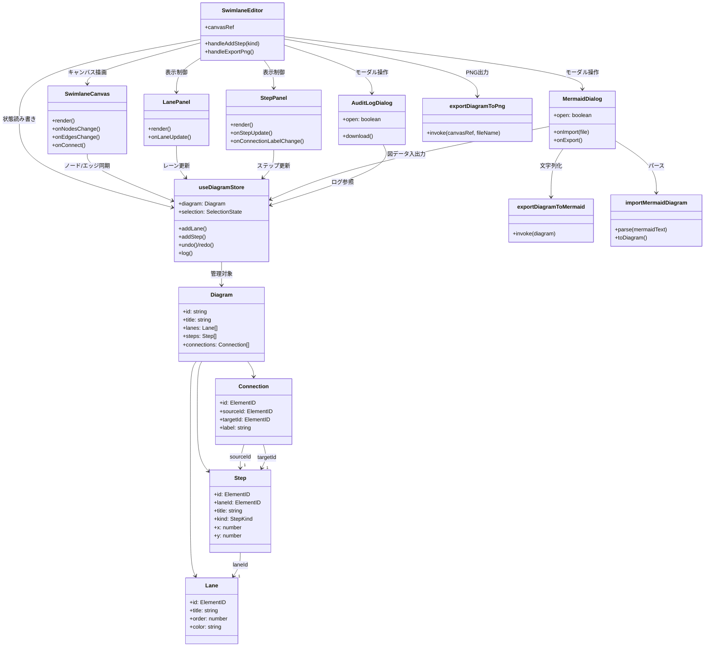

# クラス図（Swimlane Studio）

以下は主要コンポーネントとドメインモデルの関連を示したクラス図である。

## 補足
- `useDiagramStore` はZustandのカスタムフックであり、Reactコンポーネントはそれを介して状態とアクションを利用する。
- `importMermaidDiagram` は `lib/mermaid/import.ts` のユーティリティ群をまとめた概念表現で、Mermaidコードから`Diagram`型へ正規化する。
- `exportDiagramToPng` はDOM参照を受け取り、`html-to-image` 経由でPNGファイルを生成する。
- UIレイヤー（SwimlaneEditor, LanePanel, StepPanel, SwimlaneCanvas, MermaidDialog, AuditLogDialog）とユーティリティ層（`export*`, `import*`）の依存方向を矢線で示している。
- TypeScriptの型（`Diagram`, `Lane`, `Step`, `Connection`）は `lib/diagram/types.ts` で定義され、全層から参照される。
- `Step.order` は「行番号（0始まり）」として扱われ、レイアウト時にセル状グリッドへスナップされる。

本図は実装の大枠を表現したものであり、詳細な内部関数は省略している。変更を加えた場合は依存関係の影響範囲を確認し、本図を更新すること。
