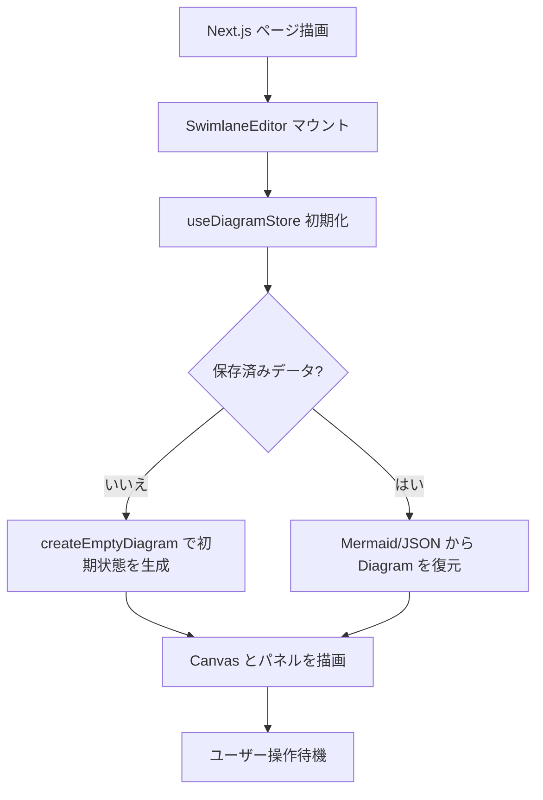
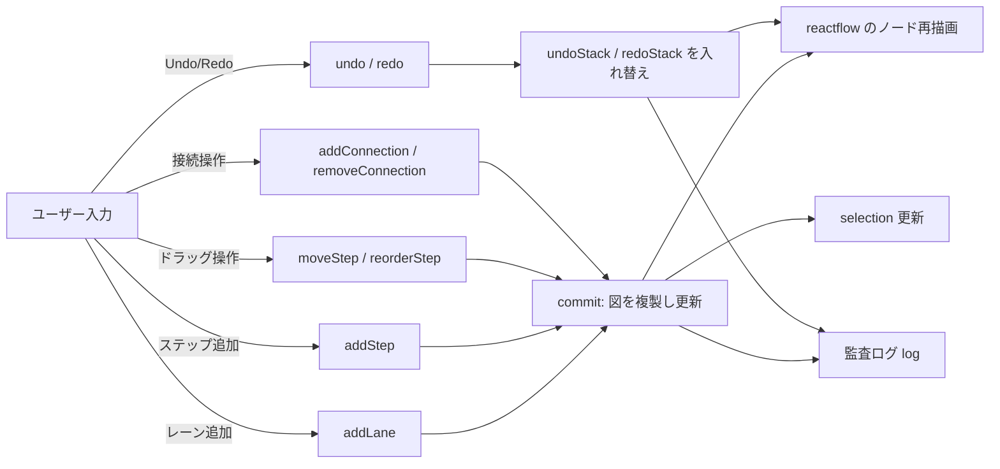
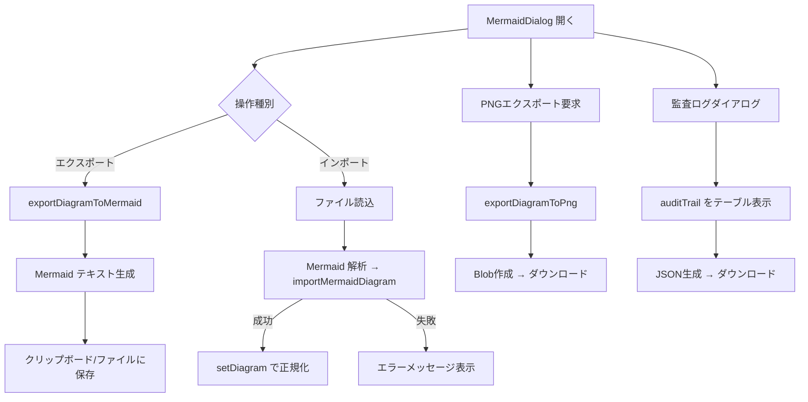

# フロー図（Swimlane Studio）

## 1. アプリケーション起動フロー


## 2. 編集操作フロー


ステップの行番号はドラッグまたはパネル入力で更新され、空行は保持される。

## 3. 入出力フロー


## 4. ステータス通知フロー
```mermaid
flowchart LR
    Input[入出力・保存系操作] --> Detect[成功/失敗ハンドラ]
    Detect -->|成功| Info[status={type:"info", text}]
    Detect -->|失敗| Error[status={type:"error", text}]
    Info --> Display[通知バー表示]
    Error --> Display
    Display --> Timer[setTimeout 4s]
    Timer --> Clear[status=null]
```

各フロー図は現行実装を基にしており、処理追加・変更時は適宜更新すること。特に編集操作フローはZustandストアのアクション追加やハンドラ分岐が増えた際に差し替える。
